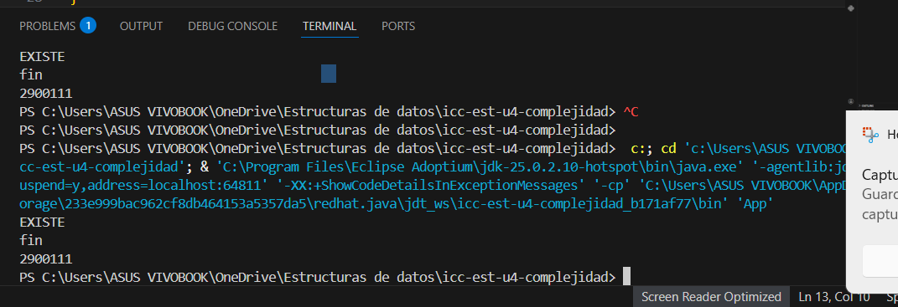

## Getting Started
# Práctica: O4.O1 Complejidad Proyecto JAVA

## Datos del Estudiante
- **Nombre:** Andrea Sagbay
- **Curso:** grupo 3
- **Fecha:** 

---

## 1. [Título de la sección] o [Practica]

**Fecha:**14/03/2026

**Descripción:** creamos el proyecto y subimos a github

---

## 2. icc-est-u4-complejidad

**Fecha:** 15/03/26
**Descripción:** Creamos la clase Estudiante y Generados y creamos un listado de estudiantes con datos aleatorios para buscar y optimizar la busqueda.

---

